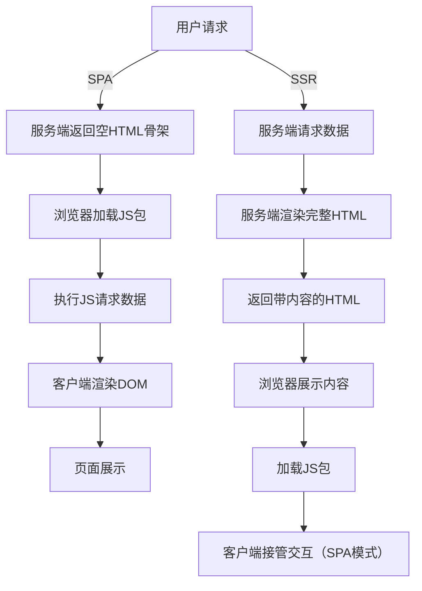

# SPA 和 SSR 的区别

## 一、核心区别：渲染位置与流程（最本质差异）

我们通过“渲染流程图”和对比表，直观理解两者的核心差异。

### 1. 渲染流程对比



### 2. 核心维度对比表

| 维度 | SPA（单页应用） | SSR（服务端渲染） |
| :--- | :--- | :--- |
| **渲染核心位置** | 客户端（浏览器） | 首屏渲染在服务端，后续交互在客户端 |
| **首次请求返回内容** | 空HTML骨架（如 `<div id="app"></div>`） | 包含完整内容的HTML（可直接展示） |
| **数据请求时机** | 客户端JS执行后异步请求 | 服务端提前请求（首屏数据） |
| **路由控制** | 全程前端路由（无刷新） | 首屏路由由服务端处理，后续前端路由 |
| **核心依赖** | 前端框架（Vue/React）+ 前端路由 | SSR框架（Nuxt/Next）+ Node.js服务 |
| **开发复杂度** | 低（无需考虑服务端环境） | 高（需兼容服务端/客户端双环境） |
| **服务器压力** | 低（仅托管静态资源） | 高（需处理渲染、数据请求） |

## 二、优劣势对比（核心取舍点）

### 1. SPA 的优劣势

| 优势 | 劣势 |
| :--- | :--- |
| **交互极致流畅**（无刷新） | **首屏加载慢**（白屏时间长） |
| 开发简单，无服务端兼容成本 | **SEO 差**（爬虫抓不到内容） |
| 服务器压力小 | 弱网/低性能设备体验差 |
| 前后端解耦彻底 | 首次加载JS包体积大 |

### 2. SSR 的优劣势

| 优势 | 劣势 |
| :--- | :--- |
| **首屏加载快**（直接展示内容） | **开发复杂度高**（需兼容双环境） |
| **SEO 友好**（爬虫能抓完整内容） | 服务器压力大（渲染消耗资源） |
| 弱网/低性能设备体验好 | 部署成本高（需Node.js服务） |
| 保留SPA的交互优势（同构） | 部分场景性能冗余（如后台系统） |

## 三、关键技术差异（前端开发视角）

作为前端开发者，你在实际编码中能直接感受到的差异：

### 1. 数据请求方式

*   **SPA**：数据请求写在 `mounted`（Vue）/ `useEffect`（React）等**仅客户端执行**的钩子中：

    ```javascript
    // SPA 写法
    export default {
      mounted() {
        // 仅客户端执行，请求数据
        this.fetchData();
      },
      methods: {
        async fetchData() {
          const res = await this.$axios.get('/api/list');
          this.list = res.data;
        }
      }
    };
    ```

*   **SSR**：数据请求写在 `asyncData`（Nuxt）/ `getServerSideProps`（Next）等**服务端执行**的钩子中：

    ```javascript
    // Nuxt SSR 写法
    export default {
      // 服务端执行，提前获取数据
      async asyncData({ $axios }) {
        const res = await $axios.get('/api/list');
        return { list: res.data }; // 数据直接注入组件
      }
    };
    ```

### 2. 环境兼容处理

*   **SPA**：可直接使用 `window`、`document`、`localStorage` 等浏览器API，无需判断环境。
*   **SSR**：必须避免在服务端执行的代码中访问浏览器API，需加环境判断：

    ```javascript
    // SSR 中安全使用浏览器API
    created() {
      if (process.client) { // Nuxt 提供的环境判断
        this.width = window.innerWidth;
      }
    }
    ```

## 四、适用场景对比（该用哪个？）

| 场景类型 | 推荐方案 | 核心原因 |
| :--- | :--- | :--- |
| **后台管理系统、内部工具** | **纯 SPA** | 无SEO需求，核心诉求是交互流畅 |
| **电商首页、商品详情页** | **SSR/SSG + SPA** | 需SEO+首屏快，后续交互需流畅 |
| **资讯/内容类网站（博客）** | **SSG（SSR变种）** | 内容静态，预渲染后性能最优 |
| **移动端/WebApp（抖音）** | **SSR + SPA** | 弱网需首屏快，交互需流畅 |

## 总结

1.  **核心差异**：SPA 全程客户端渲染，优势是交互流畅、开发简单；SSR 首屏服务端渲染，优势是首屏快、SEO 好，且保留 SPA 的交互体验。
2.  **取舍逻辑**：无 SEO/首屏性能需求 → **纯 SPA**；有 SEO/首屏性能需求 → **SSR + SPA 混合模式**。
3.  **开发关键**：SSR 开发的核心是“**兼容服务端/客户端双环境**”，避免使用浏览器专属 API，通过框架提供的钩子做服务端数据预取。

简单来说，SSR 不是替代 SPA，而是**弥补 SPA 的首屏和 SEO 短板**，最终形成“首屏 SSR 保证性能和 SEO，后续 SPA 保证交互体验”的最优解。
