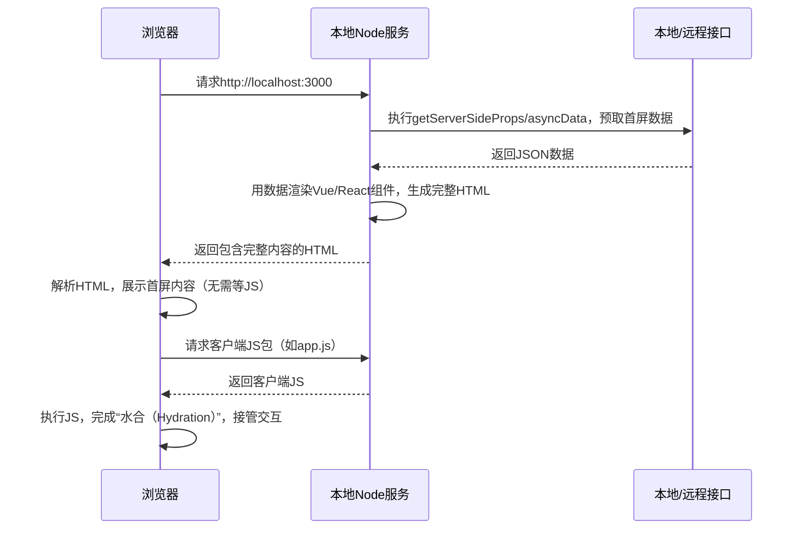

# SSR在本地是怎么渲染出来的

## 一、SSR本地渲染的核心流程（以Nuxt.js/Next.js为例）

SSR本地渲染的本质是：**在本地启动一个Node.js服务，模拟线上的服务端环境，由这个本地Node服务完成“数据预取+页面渲染”，再把渲染好的HTML返回给本地浏览器**。

以下是完整的本地渲染流程（分步骤拆解，结合实际开发操作）：

### 1. 第一步：启动本地SSR开发服务

和纯SPA的`npm run serve`不同，SSR的本地启动命令（如Nuxt/Next）会同时启动：

- **Node.js服务**：负责处理请求、执行服务端代码、渲染HTML；
- **前端开发服务**：负责热更新、静态资源托管（如CSS/JS）。

以Next.js为例，执行`npm run dev`后：

```bash
# 终端输出（本地启动成功）
ready - started server on 0.0.0.0:3000, url: <http://localhost:3000>
```

此时本地会启动一个监听3000端口的Node.js服务，所有浏览器请求都会先经过这个服务。

### 2. 第二步：浏览器发起请求（如访问http://localhost:3000）



### 3. 第三步：本地Node服务的核心操作（渲染关键）

这是SSR本地渲染的核心环节，Node服务会做3件事：

#### (1) 解析路由，找到对应页面组件

- Next.js：根据`pages`目录下的文件路径匹配路由（如`pages/index.js`对应根路由）；
- Nuxt.js：根据`pages`目录或路由配置匹配页面组件。

#### (2) 执行服务端数据预取逻辑

调用你写的`getServerSideProps`（Next）/`asyncData`（Nuxt）钩子，请求本地Mock接口或远程接口获取数据：

```javascript
// Next.js 本地开发时的数据预取（可请求本地Mock接口）
export async function getServerSideProps() {
  // 本地开发时，请求localhost的Mock接口
  const res = await fetch('http://localhost:3000/api/mock/list');
  const data = await res.json();
  return { props: { list: data } };
}
```

#### (3) 渲染组件生成完整HTML

Node服务会在内存中执行Vue/React的渲染逻辑（借助Vue的`ssrRender`、React的`renderToString`），把组件+数据转换成完整的HTML字符串：

```html
<!-- Node服务返回给浏览器的HTML（本地渲染结果） -->
<!DOCTYPE html>
<html>
  <body>
    <div id="__next">
      <!-- 服务端渲染的实际内容 -->
      <div class="list">
        <div>商品1</div>
        <div>商品2</div>
      </div>
    </div>
    <!-- 客户端JS包（后续接管交互） -->
    <script src="/_next/static/chunks/main.js"></script>
  </body>
</html>
```

### 4. 第四步：浏览器接收HTML并完成“水合”

- **第一步**：浏览器解析HTML，立即展示页面内容（这就是SSR本地能看到“首屏无白屏”的原因）；
- **第二步**：浏览器加载页面中的客户端JS包；
- **第三步**：执行JS，Vue/React会“接管”已渲染的DOM（这个过程叫“水合/Hydration”），此时页面就具备了SPA的交互能力（如点击路由跳转无刷新）。

## 二、本地开发SSR的关键配置/工具

1. **Mock数据**：本地开发时无需依赖后端接口，可通过：
    - Next.js：在`pages/api`目录下写Mock接口（如`pages/api/mock/list.js`）；
    - Nuxt.js：使用`@nuxtjs/axios`配置baseURL为本地Mock服务，或用`mockjs`生成数据。
2. **热更新**：Nuxt/Next都内置了热更新，修改组件/数据逻辑后，Node服务会重新渲染，浏览器自动刷新（保留SPA的开发体验）。
3. **调试工具**：
    - 服务端代码调试：用Node.js的inspect模式（如`next dev --inspect`），在Chrome DevTools中调试服务端代码；
    - 客户端代码调试：和SPA一样，直接在浏览器DevTools中调试。

## 三、本地渲染 vs 线上渲染的核心区别

| 维度 | 本地渲染 | 线上渲染 |
| :--- | :--- | :--- |
| **Node服务** | 本地开发服务器（热更新、调试友好） | 生产环境Node服务（性能优化、缓存） |
| **接口请求** | 本地Mock接口/测试环境接口 | 生产环境接口 |
| **资源打包** | 未压缩的开发版JS/CSS | 压缩、分包的生产版资源 |
| **性能优化** | 无（优先开发体验） | 开启缓存、压缩、CDN等 |

## 总结

1. **核心逻辑**：SSR本地渲染的关键是启动本地Node.js服务，由该服务完成“数据预取→组件渲染→生成HTML”，再返回给浏览器，浏览器展示后完成JS水合；
2. **开发体验**：本地SSR开发保留了SPA的热更新优势，同时能实时看到服务端渲染的HTML效果；
3. **关键环节**：本地渲染和线上的核心流程一致，差异仅在于环境配置（Mock数据、资源打包、性能优化）。

简单来说，SSR本地渲染就是“在你电脑上跑了一个迷你版的线上SSR服务”，让你能在开发阶段就直观看到服务端渲染的效果，避免上线后才发现渲染问题。
